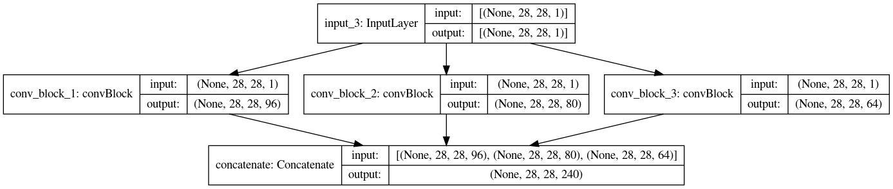

# SubClassing API 

Jump to: [Custom Training Loop](#train)

This API allows you to fully customize all aspects of your model's layers. Most architectures can be implemented with the Sequential/Functional API, but aren't as customizable. This is widely used for research purposes and complex models (eg TreeRNN). 

The SubClassing API makes use of OOP concepts to ease the coding process. For our case, we will try implement an Inception connection. 

## The building blocks 

The basic building blocks of a model are the individual layers. Using the Layer class from keras, we can define our own custom layers and computation blocks.

The final model will be an accumulation of all the Layer objects and will inherit from keras's Model class. This gives it methods like .fit() and .evaluate().

## The Layer class

This class allows us to declare and generalize on custom computation layers. Layers are declared inside the \_\_init\_\_ method and the forward pass is defined in the inherited call() method. 

For the Inception Network, we will create 3 kinds of blocks:

1. ConvBlock: Basic Convolution followed by Batch Normalization
   
```py
class convBlock(layers.Layer):
    
    def __init__(self, numKernels, kernelSize, strides, padding="same"):
        super(convBlock, self).__init__() 

        self.conv = layers.Conv2D(numKernels, kernelSize, strides = strides, padding = padding)

        self.bnorm = layers.BatchNormalization()
        self.act = layers.Activation("relu") 

    def call(self, inTensor, training = False):

        x = self.conv(inTensor)
        x = self.bnorm(x, training = training)
        x = self.act(x)

        return x
```

<div style="text-align: center">

</div>

2. InceptionBlock: Consists of 2 convolutional blocks, followed by a concatenation 

```py
class inceptionBlock(layers.Layer):

    def __init__(self, kernelSize_1, kernelSize_3):
        super(inceptionBlock, self).__init__() 

        self.conv_1 = convBlock(
            numKernels = kernelSize_1, 
            kernelSize = (1, 1), 
            strides = 1
        )

        self.conv_3 = convBlock(
            numKernels = kernelSize_3,
            kernelSize = (3, 3),
            strides = 1
        )

        self.concat = layers.Concatenate() 

    def call(self, inTensor, training = False):
        
        x_1 = self.conv_1(inTensor, training = training)
        x_3 = self.conv_3(inTensor, training = training)
        x = self.concat([x_1, x_3])

        return x
```

<div style="text-align: center">

</div>

3. downSampleBlock: It is a MaxPooling operation to extract dominant features from the previous convolution result. 

```py
class downSampleBlock(layers.Layer):

    def __init__(self, numKernels):
        super(downSampleBlock, self).__init__() 

        self.conv_3 = convBlock(
            numKernels = numKernels,
            kernelSize = (3, 3),
            strides = 2,
            padding = "valid"
        )

        self.maxPool = layers.MaxPool2D(pool_size = (3, 3), strides = 2)

        self.concat = layers.Concatenate() 

    def call(self, inTensor, training = False):

        conv = self.conv_3(inTensor, training = training)
        pool = self.maxPool(inTensor)

        cat = self.concat([conv, pool])
        return cat
```

<div style="text-align: center">

</div>

You might have noticed that the convBlock class objects were used in inceptionBlock and downSampleBlock as well. This is because the layers are recursively composable. In other words, the Layer objects track the weights of other Layer object instances assigned as an attribute. 

## The Model class

The Model class object encompasses all the Layer blocks created so far to build the final network. The Model class has the same syntax as Layer, but has an added functionality which allows us to train the model. 

```py
class InceptionModel(tf.keras.Model):

    def __init__(self, nClasses = 10):
        super(InceptionModel, self).__init__() 

        self.conv = convBlock(96, (3, 3), 1)
        
        self.incept_1 = inceptionBlock(32, 32)
        self.incept_2 = inceptionBlock(32, 48)
        self.down_1 = downSampleBlock(80)

        self.incept_3 = inceptionBlock(112, 48)
        self.incept_4 = inceptionBlock(96, 64)
        self.incept_5 = inceptionBlock(80, 80)
        self.down_2 = downSampleBlock(96)

        self.pool = layers.GlobalAveragePooling2D()

        self.flatten = layers.Flatten() 
        self.dense = layers.Dense(nClasses, activation = "softmax") 

    def call(self, inTensor, training = False):

        x = self.conv(inTensor, training = training)

        x = self.incept_1(x)
        x = self.incept_2(x)
        x = self.down_1(x)

        x = self.incept_3(x)
        x = self.incept_4(x)
        x = self.incept_5(x)
        x = self.down_2(x) 

        x = self.flatten(self.pool(x))
        x = self.dense(x)

        return x

    def build_graph(self, inShape = (28, 28, 1)):
        inp = layers.Input(shape = inShape)
        return models.Model(inputs = [inp], outputs = self.call(inp))
```

The build_graph method allows us to get a graph format of the model, on which we can call the .fit() method for training. 

<div style="text-align: center">

</div>

## Training and Evaluation 

```py
subClassModel = InceptionModel().build_graph()

subClassModel.compile(
    optimizer = tf.keras.optimizers.Adam(learning_rate = 0.00005),
    loss = tf.keras.losses.SparseCategoricalCrossentropy(),
    metrics = ['accuracy']
)

subClassModel.fit(train_gen, validation_data = val_gen, epochs = 10)

# Output
# ...
# Epoch 9/10
# 1688/1688 [==============================] - 47s 28ms/step - loss: 0.0145 - accuracy: 0.9971 - val_loss: 0.0600 - val_accuracy: 0.9803
# Epoch 10/10
# 1688/1688 [==============================] - 47s 28ms/step - loss: 0.0113 - accuracy: 0.9982 - val_loss: 0.0284 - val_accuracy: 0.9902
```

```py
subClassModel.evaluate(test_gen)

#Output
# 313/313 [==============================] - 3s 9ms/step - loss: 0.0286 - accuracy: 0.9909
# [0.028646450489759445, 0.9908999800682068]
```
<!-- <hr> -->
<br>
<br>

<a name="train">

# Custom Training Loop
</a> 

Let's say you have a specific way you want your training loop to run. Usually, we just run the .fit() method on the model to perform the training. But for added customizability to our training loop, we can strip it down to its lower level implementations and add changes there. 

To make a custom loop, we can try visualise how training happens inside the .fit() method. 

1. We iterate over the epochs. In each epoch, we iterate over each batch in the training dataset. 
   
2. Each batch input is passed through the model. The loss of the corresponding output is calculated using a loss function. For this, we used the GradientTape() scope.

3. The gradients and loss are received from the GradientTape() scope. These are used to perform weight update.

4. The accuracy, and other relevant metrics are computed from y_true and y_pred (obtained inside the GradientTape() scope), using either custom functions or predefined keras metrics. 

5. The process is repeated for other batches, over all epochs.

Lets define a custom training loop and evaluation loop for our inception model

## Training Functions

```py
@tf.function
def customTrainingStep(train_data):

    x, y_true = train_data 

    with tf.GradientTape() as tape:
        y_pred = inceptModel(x)
        loss = lossFunc(y_true, y_pred)
    
    gradient = tape.gradient(loss, inceptModel.trainable_weights)
    optim.apply_gradients(zip(gradient, inceptModel.trainable_weights))
    trainAccMetric.update_state(y_true, y_pred)
    
    return loss 

@tf.function
def customEvaluationStep(val_data):

    x_val, y_val = val_data 
    y_pred = inceptModel(x_val)
    valAccMetric.update_state(y_val, y_pred)

    return lossFunc(y_val, y_pred)
```

Here we have declared our training and evaluation step for each batch. Note that lossFunc, optim, the AccMetrics, and the model are declared outside the scope of these functions. 

Inside the scope of GradientTape(), we calculate y_pred, and the loss and gradients. These are then used for weight update using the optimizers apply_gradients() method. Using y_true and y_pred, we can also update the accuracy metric at each batch using update_state(). (The accuracy metric is reset at the end of the epoch using reset_states(), which you will see in the next code snippet). 

We will now iterate through our train_gen generator and pass each batch as arguments to customTrainingStep(). Finally, we will perform a Validation step similarly using the customEvaluationStep. 

Note that in customEvaluationStep we do not use GradientTape() as we are not training on the validation batches. 

Also note the @tf.function decorator before each function. This allows us to execute our function as a Tensorflow Graph, as the inputs are Tensors. This in turn decreases the run time significantly. 

## Iterating through training and validation tensors
```py
optim = tf.keras.optimizers.Adam(learning_rate = 0.00005)
lossFunc = tf.keras.losses.SparseCategoricalCrossentropy()
trainAccMetric = tf.keras.metrics.SparseCategoricalAccuracy()
valAccMetric = tf.keras.metrics.SparseCategoricalAccuracy()
inceptModel = InceptionModel()

epochs = 10

for epoch in range(epochs):
    print("Epoch {}/{}".format(epoch + 1, epochs))
    for batch_num, batch in enumerate(train_gen):
        loss = customTrainingStep(batch)

        if batch_num%200 == 199:
            print("Batch %d: Loss = %.3f Accuracy = %.3f" %(batch_num + 1, loss, trainAccMetric.result()))

    print("Metrics over epoch %d:" %(epoch+1))
    for batch_num, batch in enumerate(val_gen):
        val_loss = customEvaluationStep(batch)
    print("Loss: %.3f  Accuracy: %.3f\nVal Loss: %.3f  Val Accuracy: %.3f\n" %(loss, trainAccMetric.result(), val_loss, valAccMetric.result()))

    trainAccMetric.reset_states()
    valAccMetric.reset_states() 

# Output
# ... 
# Epoch 9/10
# Batch 200: Loss = 0.060 Accuracy = 0.986
# Batch 400: Loss = 0.038 Accuracy = 0.983
# Batch 600: Loss = 0.003 Accuracy = 0.985
# Batch 800: Loss = 0.052 Accuracy = 0.984
# Batch 1000: Loss = 0.113 Accuracy = 0.985
# Batch 1200: Loss = 0.022 Accuracy = 0.985
# Batch 1400: Loss = 0.013 Accuracy = 0.985
# Batch 1600: Loss = 0.016 Accuracy = 0.985
# Metrics over epoch 9:
# Loss: 0.012  Accuracy: 0.985
# Val Loss: 0.022  Val Accuracy: 0.983

# Epoch 10/10
# Batch 200: Loss = 0.007 Accuracy = 0.988
# Batch 400: Loss = 0.037 Accuracy = 0.986
# Batch 600: Loss = 0.014 Accuracy = 0.986
# Batch 800: Loss = 0.004 Accuracy = 0.986
# Batch 1000: Loss = 0.006 Accuracy = 0.986
# Batch 1200: Loss = 0.026 Accuracy = 0.987
# Batch 1400: Loss = 0.099 Accuracy = 0.986
# Batch 1600: Loss = 0.159 Accuracy = 0.986
# Metrics over epoch 10:
# Loss: 0.008  Accuracy: 0.986
# Val Loss: 0.156  Val Accuracy: 0.985
```

Likewise, you can write a separate function (or utilize the customEvaluationStep() function) to evaluate your model on the test data (test_gen). 

That's about it. Using tf.GradientTape() and a custom training loop, you can now customize your training loop however you want. This comes in really handy when training architectures like GANs. 

And just like that, you now know how to build any model you wish, to your desired complexity and customizability.

Jump To: 

1. [Home](../)
2. [Sequential API](../Sequential/)
3. [Functional API](../Functional/)

</section>
